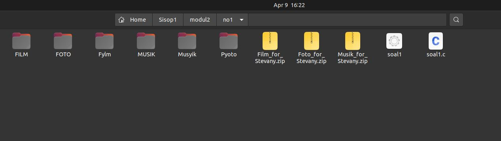
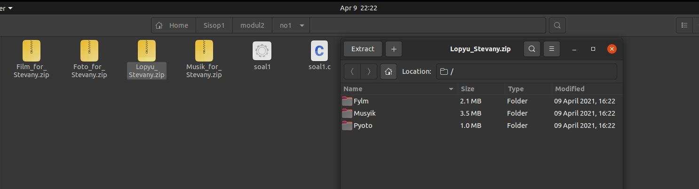
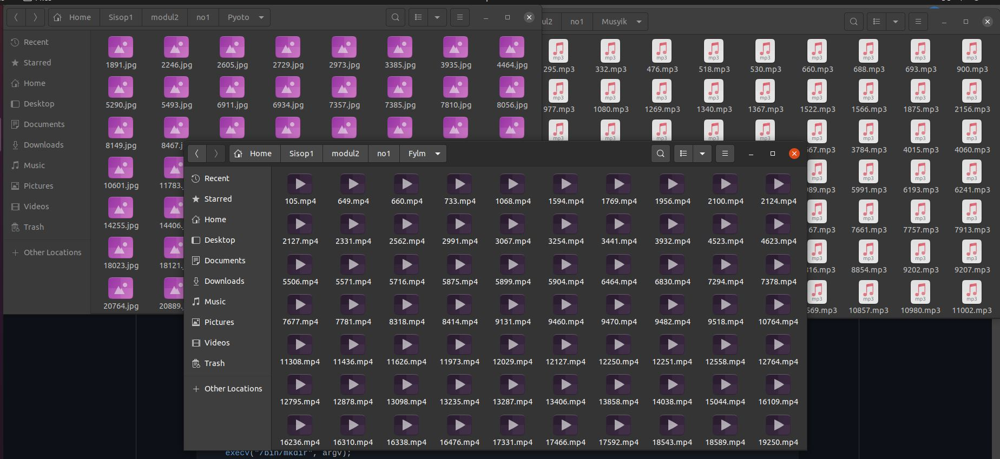
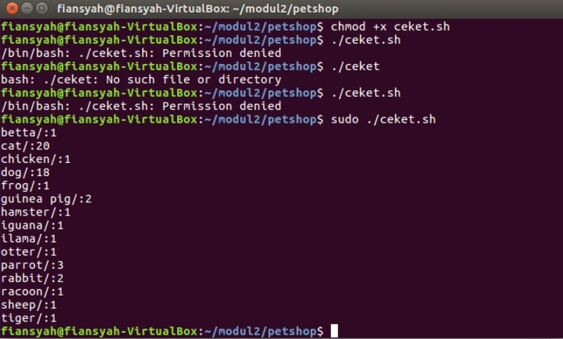
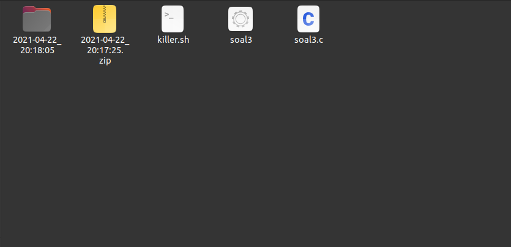

# soal-shift-sisop-modul-2-F04-2021

# Anggota Kelompok
- **Thomas Dwi Awaka** (05111940000021)
- **Muhammad Arifiansyah** (05111940000027)
- **Muhammad Rizqullah Akbar** (05111940000178)

# Pembahasan Soal
## Soal 1
Soal 1 meminta untuk membuat program yang dijalankan secara otomatis oleh 1 script di latar belakang. Sehingga perlu menggunakan __Daemon__. Program yang dibuat terdiri dari berbagai fungsi untuk menjalankan setiap tugas yang diminta dari soal. Fungsi ```main()``` menjadi fungsi utama untuk menginisiasi Daemon dengan tambahan syarat, yaitu waktu 6 jam sebelum ulang tahun Stevany (__9 April jam 16.22__) dan waktu ulang tahunnya (__9 April jam 16.22__) untuk menjalankan berbagai fungsi yang ada

### Soal 1A
pada soal 1A, program membuat folder dengan nama Musyik untuk .mp3, Fylm untuk .mp4, dan Pyoto untuk .jpg

```
void folder()
{
    pid_t child_id;
    int status;
 
    child_id = fork();
 
    if (child_id < 0)
        exit(EXIT_FAILURE);
 
    if (child_id == 0)
    {
      char *argv_1[] = {"mkdir", "-p", "Musyik", "Fylm", "Pyoto", NULL};
      execv("/bin/mkdir", argv_1);
    }
}
```

Fungsi ```folder()``` pada program akan menjalankan perintah untuk membuat folder dengan nama Musyik, Fylm, dan Pyoto. Fungsi tersebut bekerja dengan cara spawnning procces dan proses yang dilakukan adalah membuat folder dengan ```mkdir``` dari bash
```c
char *argv_1[] = {"mkdir", "-p", "Musyik", "Fylm", "Pyoto", NULL};
execv("/bin/mkdir", argv_1);
```
### Soal 1B
pada soal 1B, program mendownload folder zip dari link yang telah disediakan pada soal
```c
void wget_zip(char* link, char* name)
{
    pid_t child_id;
    int status;
 
    child_id = fork();
 
    if (child_id < 0)
        exit(EXIT_FAILURE);
 
    if (child_id == 0)
    {
      char *argv[] = {"wget", link, "-q", "-O", name, NULL};
      execv("/usr/bin/wget", argv);
    }
}

```
Di fungsi ```download()``` terdapat list argumen yang berupa link dan nama file dari file yang akan didownload. Kemudian dilakukan perulangan sebanyak jumlah file yang akan didownload, yaitu tiga. 
```c
void download(){  
...
    char *argv[3][2] = {    
    {"https://drive.google.com/uc?id=1ZG8nRBRPquhYXq_sISdsVcXx5VdEgi-J&export=download", "Musik_for_Stevany.zip"},
    {"https://drive.google.com/uc?id=1FsrAzb9B5ixooGUs0dGiBr-rC7TS9wTD&export=download", "Foto_for_Stevany.zip"},
    {"https://drive.google.com/uc?id=1ktjGgDkL0nNpY-vT7rT7O6ZI47Ke9xcp&export=download", "Film_for_Stevany.zip"}};
    for(i = 0; i< 3;i++ ){
      wget_zip(argv[i][0], argv[i][1]);
...
```
Dilanjutkan dengan fungsi ```wget_zip(link, nama file)``` yang akan spawnning proccess dan melakukan proses mendowload dari link yang diberikan dan menamai folder yang akan didowload dengan nama yang diberikan dengan ```wget``` dari bash
```c
char *argv[] = {"wget", link, "-q", "-O", name, NULL};
execv("/usr/bin/wget", argv);
```
### Soal 1C
pada soal 1C, program akan mengekstrak folder zip yang telah didownlod sebelumnya
```c
void unzip()
{
    pid_t child_id;
    int status;
 
    child_id = fork();
 
    if (child_id < 0)
        exit(EXIT_FAILURE);
 
    if (child_id == 0)
    {
      char *argv_3[] = {"unzip", "*.zip", NULL};
      execv("/usr/bin/unzip", argv_3); 
    }
}
```
Sebelum memanggil fungsi ```unzip()``` Di fungsi ```download()```, diperlukan delay dengan ```wait()``` dan ```sleep()``` untuk memberikan waktu tambahan untuk fungsi ```wget_zip()``` benar-benar selesai bekerja.
```c
void download(){  
...
    while ((wait(&status2)) > 0);
    sleep(3);
    unzip();
...
```
Fungsi ```unzip()```bertujuan untuk mengekstrak folder yang telah didownload dengan menggunakan ```unzip``` dari bash. Dengan filename ```"*.zip"```, maka program akan mengekstak semua file yang miliki akhiran ```".zip"```
```
char *argv_3[] = {"unzip", "*.zip", NULL};
execv("/usr/bin/unzip", argv_3); 
```
### Soal 1D
pada soal 1D, program akan memindahkan isi file dari hasil ekstrak file ```.zip``` yang telah didownload. Namun, pemindahan file hanya berlaku bagi file dengan ekstensi ```.mp3``` yang akan dipindah ke folder ```Musyik```,```.jpg``` yang akan dipindah ke folder ```Pyoto```, dan ```.mp4```yang akan dipindah ke folder ```Pylm```.
```c
void filter_prosess(char* sumber, char* tujuan)
{
    pid_t child_id;
    int status;
 
    child_id = fork();
 
    if (child_id < 0)
        exit(EXIT_FAILURE);
 
    if (child_id == 0)
    {
    glob_t globbuf_film;
    globbuf_film.gl_offs = 2;
    glob(sumber, GLOB_DOOFFS, NULL, &globbuf_film);
    glob(tujuan, GLOB_DOOFFS | GLOB_APPEND, NULL, &globbuf_film);
    globbuf_film.gl_pathv[0] = "cp";
    globbuf_film.gl_pathv[1] = "-r";
    execvp("cp", &globbuf_film.gl_pathv[0]);
    }
}
```
Di fungsi ```download()``` dilakukan perulangan sebanyak tiga kali untuk memindahkan isi file hasil ekstrak ke file yang dituju
```c
void download(){  
...
   while ((wait(&status5)) > 0);
   char *argv_filter[3][2] = {    
      {"FILM/*.mp4", "Fylm/"},
      {"FOTO/*.jpg", "Pyoto/"},
      {"MUSIK/*.mp3", "Musyik/"}};

      for(i = 0; i< 3;i++ ){
         filter_prosess(argv_filter[i][0], argv_filter[i][1]);
      }
...
```
Fungsi ```wait()``` bertujuan untukmemberikan waktu tambahan untuk fungsi ```folder()``` benar-benar selesai bekerja.
Di bahasa C, _wildcard_ pada linux tidak dapat dipakai untuk mencari file dengan ciri tertentu. Sehingga perlu tambahan library ```#include <glob.h>``` dan denngan struct ```glob_t```  yang dapat memudahkan untuk melakukan pencarian file layaknya menggunakan _wildcard_.
```c
    glob_t globbuf_film;
    globbuf_film.gl_offs = 2;
    glob(sumber, GLOB_DOOFFS, NULL, &globbuf_film);
    glob(tujuan, GLOB_DOOFFS | GLOB_APPEND, NULL, &globbuf_film);
    globbuf_film.gl_pathv[0] = "cp";
    globbuf_film.gl_pathv[1] = "-r";
    execvp("cp", &globbuf_film.gl_pathv[0]);
```
### Soal 1E
pada soal 1E, program dibuat untuk menjalan seluruh perintah diatas, soal 1A-D, secara otomatis 6 jam sebelum ulang tahun Stevany.
```c
Ini masih direvisi :(
```
Untuk memastikan program berjalan tepat sebelum 6 jam sebelum ulang tahun Stevany, maka dengan library ```#include <time.h>```, program dapat menggunakan  ```time_t``` untuk memperoleh waktu saat program berjalan dan ```struct tm``` untuk memudahkan memeriksa nilai bulan dari ```tm_mon+1```, hari dari ```tm_mday```, jam dari ```tm_mhour```, menit dari ```tm_min```, detik dari ```tm_sec```. Dari nilai tersebut maka dapat dilakukan pengecekan waktu selama program berjalan.
```c
int main(){
...
 time_t my_time;
  struct tm *timeinfo; 
  while(1){
  time (&my_time);
  timeinfo = localtime (&my_time);
  if(timeinfo->tm_mday == 9 && timeinfo->tm_mon+1 == 4 && timeinfo->tm_hour == 16 && timeinfo->tm_min == 21 && timeinfo->tm_sec == 59){
    ...
    }
  }
...
}
```
Jika waktu pada sistem sesuai dengan syarat yang diminta (__jam 16:22__), maka program akan lanjut ke fungsi ```download()``` yang berisi perintah yang telah ditulis pada soal 1A-D.
```c
int main(){
...
if(timeinfo->tm_mday == 9 && timeinfo->tm_mon+1 == 4 && timeinfo->tm_hour == 1 6&& timeinfo->tm_min == 21 && timeinfo->tm_sec == 59){
   download();
   sleep(3);
   }
...
}
```
Fungsi ```sleep(3)``` bertujuan untuk menghindari pemanggilan fungsi ```download`()`` yang mungkin terjadi berkali-kali dengan memberi jeda pada program.
### Soal 1F
pada soal 1F, program dibuat untuk men-zip semua folder(Fylm, Pyoto, Musyik) dengan nama __Lopyu_Stevany.zip__ dan menghapus semua folder.
```c
void hbd(){
  int status,status2;
  time_t t_now = time(NULL);
  struct tm waktu = *localtime(&t_now);
 
while(wait(&status2)>0);
 
  while(strcmp(path,"09-04_22:22") !=0){
    sleep(2);
    t_now = time(NULL);
    waktu = *localtime(&t_now);
    strftime(path, sizeof(path)-1, "%d-%m_%H:%M", &waktu);
    }
 
  pid_t child_id;
  child_id = fork();
 
  if (child_id < 0) {
    exit(EXIT_FAILURE); // Jika gagal membuat proses baru, program akan berhenti
   } 
 
  if (child_id == 0) {
    char *argv_6[] = {"rm","-rf", "MUSIK", "FOTO", "FILM", NULL};
    execv("/bin/rm", argv_6);
  } else{
    while(wait(&status)>0);
    char *argv_4[] = {"zip", "-rm", "Lopyu_Stevany", ".", "-x", "soal1*", "*.zip", NULL};
    execv("/bin/zip", argv_4);
  }
}
```
dengan ```time_t``` untuk memperoleh waktu saat program berjalan dan ```struct tm``` untuk memudahkan memeriksa nilai bulan, hari, jam, dan menit. Selama waktu sistem belum menunjukan jam 22:22, maka akan dilakukan looping dengan while dan sleep selama 2 detik untuk menunggu waktu hingga jam 22:22. Cara membandikan waktu pada sistem dengan waktu yang dituju dengan menggunakan ```strcmp()``` karena waktu sistem disimpan dalam string dengan menggunakan ```strftime()```.
```c
void hbd(){ 
...
  time_t t_now = time(NULL);
  struct tm waktu = *localtime(&t_now);
  while(strcmp(path,"09-04_22:22") !=0){
    sleep(2);
    t_now = time(NULL);
    waktu = *localtime(&t_now);
    strftime(path, sizeof(path)-1, "%d-%m_%H:%M", &waktu);
    }
...
}
```
Jika waktu telah menunjukan jam 22:22, maka looping ```while``` akan berhenti dan melanjutkan fungsi ```hbd()```, yaitu spawning proccess untuk menghapus seluruh folder dengan ```rm -rf```
```c
void hbd(){ 
...
if (child_id == 0) {
    char *argv_6[] = {"rm","-rf", "MUSIK", "FOTO", "FILM", NULL};
    execv("/bin/rm", argv_6);
  }
...
}
```
dan men-zip seluruh isi folder  dan menghapus yang telah di-zip dengan ```zip -rm```. untuk argumen zip ini diberikan tambahan pengecualian agar tidak men-zip file _source code_ dan file dengan ekstensi .zip dengan ```-x```
```c
void hbd(){ 
...
else{
    while(wait(&status)>0);
    char *argv_4[] = {"zip", "-rm", "Lopyu_Stevany", ".", "-x", "soal1*", "*.zip", NULL};
    execv("/bin/zip", argv_4);
  }
...
}
```
#### Kendala
Program dapat berjalan sesuai dengan soal yang diberikan. Namun, Setelah selesai membuat Lopyu_Stevany.zip, program tidak berjalan lagi. 
#### Screenshot jalannya progran
__Soal 1A-D

Soal 1F

Isi folder__


## Soal 2
### Soal 2A
Membuat program c untuk mengextract file pets.zip yang diberikan ke dalam folder “/home/[user]/modul2/petshop”. Kemudian membuat program untuk memilah file yang dibutuhkan dan yang tidak
```c
if (child_id == 0) {
    // this is child
 
    char *argv[] = {"mkdir","/home/user/modul2/", NULL};
    execv("/bin/mkdir", argv);
 
  } else {
 
    // this is parent
    while ((wait(&status)) > 0);
   execlp("unzip","unzip","-j","pets.zip","-i","*.jpg","-d","/home/user/modul2/petshop",NULL);
 
 
   }
```
Pada fungsi diatas kita melakukan spawning process, dimana child process akan melakukan `exec` untuk membuat direktori baru dengan nama sesuai parameter saat fungsi dipanggil di *main*. Lalu pada parent process akan menunggu hingga process di child selesai dan melakukan `exec` untuk menunzip filenya dan menempatkan file hasil `unzip` ke dalam direktori `/home/user/modul2/petshop` serta membuang file yang tidak diperlukan.

### Soal 2B
Membuat program c untuk membuat folder-folder jenis jenis peliharaan yang ada dalam file *pets.zip tersebut*.
```c
 pid_t child_id1;
  int status;
 
  child_id1 = fork();
 
  if (child_id1 < 0) {
 
  exit(EXIT_FAILURE); // Jika gagal membuat proses baru, program akan berhenti
  }
  if (child_id1 == 0) {
 
 
    // this is child
   chdir("/home/user/modul2/petshop");
 
    char *argv[] = {"mkdir",token1, NULL};
    execv("/bin/mkdir", argv);
 
 
  } else {
    // this is parent
    while ((wait(&status)) > 0);
	function2111(token1,filename,petname,age);
    return;
 
  }
 
}
```
 Pertama dengan menggunakan `chdir` direktori di set di direktori *petshop*. Kemudian membuat direktori sesuai nama parameter yakni nama-nama jenis peliharaan dengan `exec`.
 ### Soal 2C
Membuat program c memindahkan foto ke folder dengan kategori yang sesuai dan di rename dengan nama peliharaan.
```c
void function21111(char token[],char * nama,char * petname,char age[])
{
 pid_t child_id1;
  int status;
  child_id1 = fork();
  if (child_id1 < 0) {
  exit(EXIT_FAILURE); // Jika gagal membuat proses baru, program akan berhenti
  }
  if (child_id1 == 0) {
    chdir("/home/user/modul2/petshop");
 
   char *argv[] = {"mv",nama,token, NULL};
   execv("/bin/mv", argv);
  }
  else{
    while ((wait(&status)) > 0);
    function211111(token,nama,petname,age);
   return;
  }
}

void function2111(char token[],char * filename,char * petname,char age[])
{
 pid_t child_id1;
  int status;
 
	age[strlen(age)-1]=' ';
	age[strlen(age)-2]=' ';
	age[strlen(age)-3]=' ';
	age[strlen(age)-4]=' ';
    chdir("/home/user/modul2/petshop");
    chdir(token);
    FILE *fp;
    fp=fopen("keterangan.txt","a");
    fprintf(fp,"Nama:%s\nUmur:%s\n",petname,age);
    fclose(fp);
 
  char *nama=strcat(petname,".jpg");
 
 
  child_id1 = fork();
  if (child_id1 < 0) {
  exit(EXIT_FAILURE); // Jika gagal membuat proses baru, program akan berhenti
  }
  if (child_id1 == 0) {
 
    chdir("/home/user/modul2/petshop");
 
   char *argv[] = {"mv",filename,nama, NULL};
   execv("/bin/mv", argv);
  }
  else{
    while ((wait(&status)) > 0);
   function21111(token,nama,petname,age);
   return;
 
  }
 
}
```
*function2111()* untuk merename nama file menjadi nama hewan peliharaan. *function21111* untuk memindahkan file ke dalam folder sesuai jenis hewan peliharaan.
 ### Soal 2D
Membuat satu foto yang terdapat lebih dari satu peliharaan maka foto harus di pindah ke masing-masing kategori yang sesuai. 
```c

void function21211111(char * filename,char * folder,char token[],char * nama,char * nama1, char * nama2)
{
printf("filekeduakuterakhir:%s\n",filename);
 
  pid_t child_id1;
  int status;
  child_id1 = fork();
  if (child_id1 < 0) {
  exit(EXIT_FAILURE); // Jika gagal membuat proses baru, program akan berhenti
  }
  else if (child_id1 == 0) {
 
    // this is child
    chdir("/home/user/modul2/petshop");
    char *argv[] = {"mv",strcat(nama1,".jpg"),token, NULL};//belum selesai
    execv("/bin/mv", argv);
 
  } else {
    // this is parent
    while ((wait(&status)) > 0);
         buatfilekedua(filename,folder,nama2);
    return;
  }
}
 
 
void function2121111(char * filekedua,char * folderkedua,char token[],char * nama, char * nama1, char * nama2)
{
  pid_t child_id1;
  int status; 
 
   child_id1 = fork();
  if (child_id1 < 0) {
  exit(EXIT_FAILURE); // Jika gagal membuat proses baru, program akan berhenti
  }
  if (child_id1 == 0) {
 
    chdir("/home/user/modul2/petshop");
 
      char *argv[] = {"mv",nama,strcat(nama1,".jpg"), NULL};//belum selesai
      execv("/bin/mv", argv);
  } else {
    // this is parent
    while ((wait(&status)) > 0);
    function21211111(filekedua,folderkedua,token,nama,nama1,nama2);
    return;
  }
}

void  pivot(char * filekedua,char * folderkedua,char token[],char * nama, char * nama1, char * nama2)
{
  pid_t child_id1;
  int status;
   child_id1 = fork();
  if (child_id1 < 0) {
  exit(EXIT_FAILURE); // Jika gagal membuat proses baru, program akan berhenti
  }
  if (child_id1 == 0) {
 printf("filekedua=%s...........................%s\n",nama,nama1);
    // this is child
    chdir("/home/user/modul2/petshop");
 
      char *argv[] = {"mv",strcat(nama2,".jpg"),folderkedua, NULL};//belum selesai
      execv("/bin/mv", argv);
  } else {
    // this is parent
    while ((wait(&status)) > 0);
    function2121111(filekedua,folderkedua,token,nama,nama1,nama2);
    return;
  }
}
 
void function212111(char * filekedua,char * folderkedua,char token[],char * nama,char * nama1, char * nama2)
{
  pid_t child_id1;
  int status;
  child_id1 = fork();
  if (child_id1 < 0) {
  exit(EXIT_FAILURE); // Jika gagal membuat proses baru, program akan berhenti
  }
  if (child_id1 == 0) {
    // this is child
   chdir("/home/user/modul2/petshop");
    char *argv[] = {"mv",filekedua,strcat(nama2,".jpg"), NULL};//belum selesai
    execv("/bin/mv", argv);
 
  } else {
    // this is parent
    while ((wait(&status)) > 0);
       pivot(filekedua,folderkedua,token,nama,nama1,nama2);
	 return;
 
  }
 
}
 
void function21211(char token[],char *token3,char * filename,char * nama, char * nama1,char * nama2)
{
       int panjang=strlen(filename);
       char str[panjang],str1[panjang];
       strcpy(str,filename);
       strcpy(str1,str);
       int add=0;
       char* filekedua=strtok(str1,"_");
       filekedua=strtok(NULL,"_");
 
 pid_t child_id1;
  int status;
  child_id1 = fork();
  if (child_id1 < 0) {
  exit(EXIT_FAILURE); // Jika gagal membuat proses baru, program akan berhenti
  }
  if (child_id1 == 0) {
    chdir("/home/user/modul2/petshop");
   char *argv[] = {"mv",filename,filekedua,NULL};//perlu diganti banget
   execv("/bin/mv", argv);
  }
  else{
    while ((wait(&status)) > 0);
    function212111(filekedua,token3,token,nama,nama1,nama2);
   return;
 
  }
 
}

void function2121(char token[],char *token3,char * filename,char * nama1, char * nama2,char * age1,char * age2)
{
 
    chdir("/home/user/modul2/petshop");
    chdir(token);
    FILE *fp;
    fp=fopen("keterangan.txt","a");
    fprintf(fp,"Nama:%s\nUmur:%s\n",nama1,age1);
    fclose(fp);
 
       int panjang=strlen(filename);
       char str[panjang],str1[panjang];
       strcpy(str,filename);
       strcpy(str1,str);
       int add=0;
       char* token4=strtok(str1,"_");
       token4=strtok(NULL,"_");
 
char * nama=strcat(str1,".jpg");
 pid_t child_id1;
  int status;
  child_id1 = fork();
  if (child_id1 < 0) {
  exit(EXIT_FAILURE); // Jika gagal membuat proses baru, program akan berhenti
  }
  if (child_id1 == 0) {
   // this is childi
    chdir("/home/user/modul2/petshop");
   char *argv[] = {"cp",filename,nama, NULL};//diubah
   execv("/bin/cp", argv);
  }
  else{
    while ((wait(&status)) > 0);
    function21211(token,token3,filename,nama,nama1,nama2);
   return;
 
  }
 
}
 
```
fungsi *function2121*  memcopy file yang memiliki 2 hewan peliharaan menjadi 2 gambar, parameter *nama* disini adalah proses pertama pemisahan nama dengan isi nama file 1 hewan. Jadi akan ada 2 file. Pertama file dengan 2 nama hewan, dan 1 file lagi sudah spesifik nama file hewan yang sudah terdiri dengan jenis peliharaan,nama hewan,dan umur.
fungsi *function21211* mengubah file yang masih memiliki nama file 2 hewan menjadi 1 hewan. Sehingga foto sudah terbagi menjadi 2.
fungsi *function212111* mengubah namafile menjadi nama hewan peliharaan & fungsi *pivot* memindahkan file pada fungsi *function212111* ke dalam direktori jenis hewan yang sesuai. Fungsi *function2121111* mengubah 1 file hewan tersisa yang masih di direktori petshop menjadi nama hewan peliharaan kemudian Fungsi *function21211111* memindahkan file tersebut ke direktori yang sesuai dengan jenis hewan peliharaan.

### Soal 2E
Membuat program C dimana program membuat sebuah file "keterangan.txt" yang berisi nama dan umur semua peliharaan dalam setiap folder jenis hewan peliharaan
```c
void function2111(char token[],char * filename,char * petname,char age[])
{
 pid_t child_id1;
  int status;
 
	age[strlen(age)-1]=' ';
	age[strlen(age)-2]=' ';
	age[strlen(age)-3]=' ';
	age[strlen(age)-4]=' ';
    chdir("/home/user/modul2/petshop");
    chdir(token);
    FILE *fp;
    fp=fopen("keterangan.txt","a");
    fprintf(fp,"Nama:%s\nUmur:%s\n",petname,age);
    fclose(fp);
 
  char *nama=strcat(petname,".jpg");
 
 
  child_id1 = fork();
  if (child_id1 < 0) {
  exit(EXIT_FAILURE); // Jika gagal membuat proses baru, program akan berhenti
  }
  if (child_id1 == 0) {
 
    chdir("/home/user/modul2/petshop");
 
   char *argv[] = {"mv",filename,nama, NULL};
   execv("/bin/mv", argv);
  }
  else{
    while ((wait(&status)) > 0);
   function21111(token,nama,petname,age);
   return;
 
  }
 
}
```
```c
void function2121(char token[],char *token3,char * filename,char * nama1, char * nama2,char * age1,char * age2)
{
 
    chdir("/home/user/modul2/petshop");
    chdir(token);
    FILE *fp;
    fp=fopen("keterangan.txt","a");
    fprintf(fp,"Nama:%s\nUmur:%s\n",nama1,age1);
    fclose(fp);
 
       int panjang=strlen(filename);
       char str[panjang],str1[panjang];
       strcpy(str,filename);
       strcpy(str1,str);
       int add=0;
       char* token4=strtok(str1,"_");
       token4=strtok(NULL,"_");
 
char * nama=strcat(str1,".jpg");
 pid_t child_id1;
  int status;
  child_id1 = fork();
  if (child_id1 < 0) {
  exit(EXIT_FAILURE); // Jika gagal membuat proses baru, program akan berhenti
  }
  if (child_id1 == 0) {
   // this is childi
    chdir("/home/user/modul2/petshop");
   char *argv[] = {"cp",filename,nama, NULL};//diubah
   execv("/bin/cp", argv);
  }
  else{
    while ((wait(&status)) > 0);
    function21211(token,token3,filename,nama,nama1,nama2);
   return;
 
  }
 
}
```
```c
void buatfilekedua(char * filename,char * folder,char * nama2)
{
printf("filekeduakuterakhir:%s\n",filename);
 
  pid_t child_id1;
  int status;
  child_id1 = fork();
  if (child_id1 < 0) {
  exit(EXIT_FAILURE); // Jika gagal membuat proses baru, program akan berhenti
  }
  else if (child_id1 == 0) {
 
       char str[strlen(filename)],str1[strlen(filename)];
       strcpy(str,filename);
       strcpy(str1,str);
       char* token=strtok(str1,";");
       token=strtok(NULL,";");
       token=strtok(NULL,".jpg");
 
    chdir("/home/user/modul2/petshop");
    chdir(folder);
    FILE *fp;
    fp=fopen("keterangan.txt","a");
    fprintf(fp,"Nama:%s\nUmur:%s\n",nama2,token);
    fclose(fp);
 
    char *argv[] = {"echo","saya", NULL};//belum selesai
    execv("/bin/echo", argv);
 
  } else {
    // this is parent
    while ((wait(&status)) > 0);
        // buatfilekedua(filename,folder,nama2);
	return;
  }
}
```
fungsi *function2111* digunakan untuk membuat file txt untuk menyimpan nama hewan dan umur hewan tersebut dengan syarat foto hewan terdiri dari gambar 1 hewan peliharaan.
fungsi *buatfilekedua* dan fungsi *function2121* digunakan untuk menyimpan nama hewan dan umur hewan tersebut dengan syarat foto hewan terdiri dari gambar 2 hewan peliharaan.


#### Kendala
Penggunaan `strcat` dan `strtok` yang terlalu banyak akan membuat jalannya program menjadi terganggu sehingga harus mengurangi penggunaannya sehingga konsekuensinya syntax program menjadi sangat panjang
#### Screenshot jalannya progran



## Soal 3
### Soal 3A
Membuat program C dimana setiap 40 detik membuat sebuah direktori dengan nama sesuai timestamp [YYYY-mm-dd_HH:ii:ss].
```c
void mk_dir(char *name)
{
    pid_t child_id;
    int status;

    child_id = fork();
    if (child_id < 0)
    {
        exit(EXIT_FAILURE); // Jika gagal membuat proses baru, program akan berhenti
    }

    if (child_id == 0)
    {
        char *argv[] = {"mkdir", "-p", name, NULL};
        execv("/bin/mkdir", argv);
        exit(EXIT_SUCCESS);
    }
    else
    {
        while (wait(&status) > 0);
        download_img(name);
    }
}
```
Pada fungsi diatas kita melekakukan spawning process, dimana child process akan melakukan `exec` untuk membuat direktori baru dengan nama sesuai parameter saat fungsi dipanggil di *main*, dan dilakukan sleep di *main* selama 40 detik sesuai yang diminta soal. Lalu pada parent process akan menunggu hingga process di child selesai dan memanggil fungsi `download_img()` untuk mengunduh gambar.
### Soal 3B
Setiap direktori yang sudah dibuat diisi dengan 10 gambar yang diunduh dari link yang diberikan, dimana setiap gambar akan diunduh setiap 5 detik. Setiap gambar juga harus dinamakan sesuai timestamp dan ukurannya ditentukan dengan rumus (n%1000) + 50, diman *n* adalah *detik Epoch UNIX*.
```c
void download_img(char *location)
{
    pid_t child_id;
    int status;

    child_id = fork();
    if (child_id < 0)
    {
        exit(EXIT_FAILURE); // Jika gagal membuat proses baru, program akan berhenti
    }

    if (child_id == 0)
    {
        chdir(location);
        char waktusekarang[50], link[50];
        int i;
        for (i = 0; i < 10; i++)
        {
            time_t t_now = time(NULL);
            struct tm waktu = *localtime(&t_now);
            strftime(waktusekarang, sizeof(waktusekarang) - 1, "%Y-%m-%d_%H:%M:%S", &waktu);
            snprintf(link, sizeof(link) - 1, "https://picsum.photos/%ld", (t_now % 1000) + 50);

            wget_img(link, waktusekarang);

            sleep(5);
        }
        
        Chyper("Download Success");
        FILE *chy;
        chy = fopen("status.txt", "w");
        fprintf(chy, "%s", pesanChyper);
        fclose(chy);

        exit(EXIT_SUCCESS);
    }
    else
    {
        while (wait(&status) > 0);

        zip_it(location);
    }
}
```
Sama seperti fungsi sebelumnya akan dilakukan spawning process, dimana pada child process akan dilakukan perpindahan direktori ke yang sudah dibuat di *Soal 3A* . Lalu akan dilakukan looping sebanyak 10 kali untuk mempersiapkan data untuk mengunduh gambar, dimana pada fungsi ini akan ditentukan nama file gambarnya dan linknya dengan ukuran gambar sesuai rumus yang diberikan. untuk mendapatkan *detik Epoch UNIX* menggunakan `time(NULL)`. Kemudian dipanggil fungsi `wget_img()` untuk dilakukan pengunduhan gambar. Lalu pada parent process akan menunggu hingga process pada child selesai kemudian memanggil fungsi `zip_it()` untuk mengkompres direktori.
```c
void wget_img(char* link, char* name)
{
    pid_t child_id;
    int status;

    child_id = fork();

    if (child_id < 0)
        exit(EXIT_FAILURE);

    if (child_id == 0)
    {
        char *argv[] = {"wget", link, "-q", "-O", name, NULL};
        execv("/usr/bin/wget", argv);
        exit(EXIT_SUCCESS);
    }
}

```
Pada fungsi ini digunakan untuk mengeksekusi perintah wget sesuai dengan parameter-parameter yang diberikan pada saat fungsi dipanggil, yaitu link untuk mengunduh foto dan juga nama file.
### Soal 3C
Membuat file *status.txt* dimana di dalamnya berisi pesan *"Download Success"* yang terenkripsi menggunakan metode *Caesar Cipher* yang di shift 5 kali. Lalu akan dizip dan direktorinya akan dihapus.
```c
void Chyper(char text[])
{
    int i;
    for (i = 0; i < strlen(text); i++)
    {
        char ch = text[i];
        if (ch == ' ')
        {
            pesanChyper[i] = ' ';
            continue;
        }
        if (isupper(ch))
        {
            pesanChyper[i] = (char)(ch - 'A' + 5) % 26 + 'A';
            continue;
        }
        if (islower(ch))
        {
            pesanChyper[i] = (char)(ch - 'a' + 5) % 26 + 'a';
            continue;
        }
    }
}
```
Pada fungsi ini akan mengubah string dan dishift sebanyak 5 kali.
```c
        Chyper("Download Success");
        FILE *chy;
        chy = fopen("status.txt", "w");
        fprintf(chy, "%s", pesanChyper);
        fclose(chy);
```
Pada fungsi `download_img()` fungsi `Chyper()` akan dipanggil dan akan memodifikasi string yang diberikan dan menuliskannya ke file *status.txt*.
```c
void zip_it(char *name)
{
    pid_t child_id;
    int status;

    child_id = fork();

    if (child_id < 0)
        exit(EXIT_FAILURE);

    if (child_id == 0)
    {
        char *argv[] = {"zip", "-rm", name, name, "status.txt", NULL};
        execv("/usr/bin/zip", argv);
        exit(EXIT_SUCCESS);
    }
}
```
Pada fungsi ini akan dilakukan spawning process dan child processnya akan melakukan `exec` untuk mengkompres direktori yang diinginkan menjadi `.zip` dan direktori akan otomatis terhapus.
### Soal 3D dan 3E
```c
FILE *killer;
    killer = fopen("killer.sh", "w");
    if (strcmp(argv[1], "-z") == 0)
    {
        fprintf(killer, "#!/bin/bash\narr=($(ps -aux | grep './soal3' | awk '{ print $2 }'))\nfor i in ${arr[@]}\ndo\nkill -9 $i\ndone\nrm \"$0\"");
    }
    else if (strcmp(argv[1], "-x") == 0)
    {
        fprintf(killer, "#!/bin/bash\narr=($(ps -aux | grep './soal3' | awk '{ print $2 }'))\nkill -9 ${arr[0]}\nrm \"$0\"");
    }
    fclose(killer);

```
Pada baris kode ini akan dibuat file killer.sh untuk menghentikan proses yang ada sesuai dengan argumen yang dipilih.
```bash
#!/bin/bash
arr=($(ps -aux | grep './soal3' | awk '{ print $2 }'))
for i in ${arr[@]}
do
    kill -9 $i
done
rm "$0"
```
Pada saat argumen yang diberikan adalah `-z` maka file *killer.sh* yang dibuat adalah seperti diatas. dimana akan mencari PID terlebih dahulu menggunakan `ps -aux` dan disimpan didalam array. Setelah itu akan dilakukan `kill -9` untuk setiap PID yang didapatkan. Selanjutnya akan menghapus file *killer.sh* menggunakan `rm "$0"`.
```bash
#!/bin/bash
arr=($(ps -aux | grep './soal3' | awk '{ print $2 }'))
kill -9 ${arr[0]}
rm "$0"
```
Pada saat argumen yang diberikan adalah `-x` maka file *killer.sh* yang dibuat adalah seperti diatas. dimana akan mencari PID terlebih dahulu menggunakan `ps -aux` dan disimpan didalam array. Setelah itu akan dilakukan `kill -9` untuk PID pada child process didalam main. Selanjutnya akan menghapus file *killer.sh* menggunakan `rm "$0"`.
#### Kendala

- Kesulitan untuk bisa menunggu program yang sedang berjalan selesai terlebih dahulu.
- Harus melakukan beberapa spawning process untuk bisa membuat file setiap 40 detik dan menyelesaikan saat di`kill`.

#### Screenshot jalannya progran


